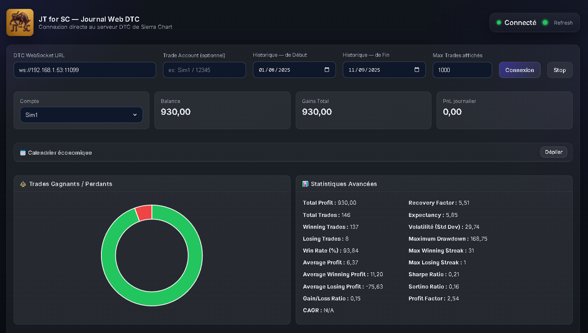
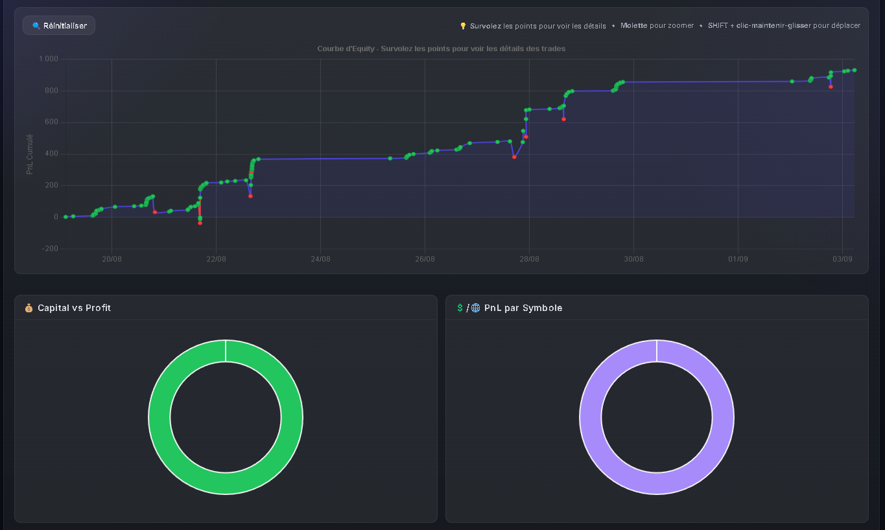
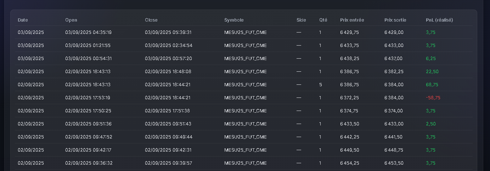
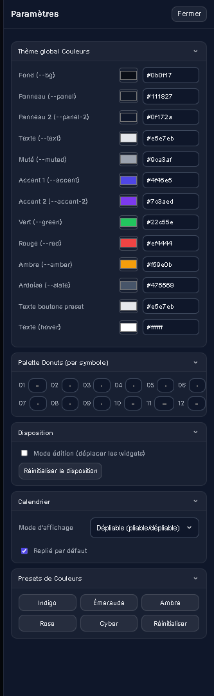
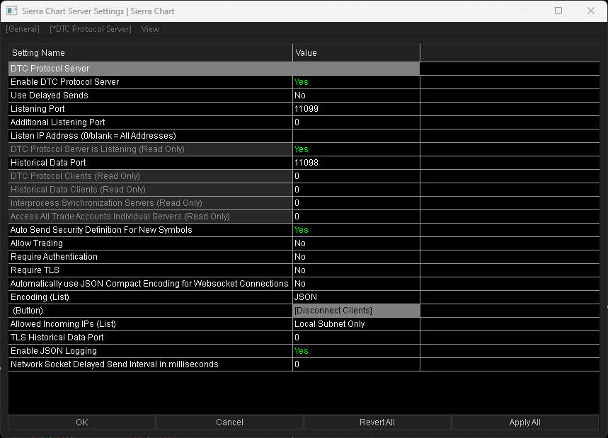

# JT for SC — Journal Web DTC pour Sierra Chart

> Dashboard web local connecté au **serveur DTC** (Sierra Chart) : KPI, stats avancées, **courbe d’equity**, **donuts** par performance, **journal des trades**, **thème & layout** personnalisables, **calendrier économique**.

- **Client pur (HTML/CSS/JS)** — aucun backend requis.
- Connexion **WebSocket DTC** (URL configurable dans l’UI).
- **Charts interactifs** (Chart.js + zoom/pan), persistences via `localStorage`.

---

## 🤝 Contributions & forks bienvenus — Maintainer recherché

Je n’ai **plus le temps de maintenir activement** ce projet.  
Si tu le trouves utile, **contribue** (PR/Issues) ou **forke** librement (licence MIT).  
Je suis **ouvert à passer le relais** à un(e) maintainer motivé(e).

[](./issues)
[](https://docs.github.com/en/pull-requests)
[](http://unmaintained.tech/)

**Comment aider, vite fait :**
- **Fork** le dépôt → clone ton fork en local. :contentReference[oaicite:0]{index=0}  
- Crée une branche (`feat/…`), commite, pousse, puis **ouvre une Pull Request** propre (résumé, étapes de test). :contentReference[oaicite:1]{index=1}
- Si tu veux devenir **maintainer**, ouvre une issue “Maintainer candidacy” en décrivant ton plan (release, tri des issues, CI).

**Bonnes pratiques recommandées :**
- Ajoute/consulte un `CONTRIBUTING.md` pour les règles de contribution (format des PR, style, tests). :contentReference[oaicite:2]{index=2}
- Reste conforme à la **licence MIT** (attribution), même en fork.  
- Merci d’ouvrir une issue pour les bugs majeurs avant de proposer une PR.

> Note badges :  
> • “No Maintenance Intended” indique que je ne garantis pas d’évolutions ni de support,
> tout en **autorisant forks et réutilisations**. :contentReference[oaicite:3]{index=3}  
> • Les badges sont fournis par **shields.io** (tu peux adapter texte/couleurs). :contentReference[oaicite:4]{index=4}

---

## 📸 Captures d’écran

> Les fichiers sont sous `docs/`.

1. **En-tête & connexion DTC + KPI**  
   

2. **Calendrier de News**  
      

3. **Courbe d’equity + donuts**  
   

4. **Journal des trades (tableau)**  
   

5. **Panneau Paramètres (thème, palette, layout, calendrier)**  
   
   
6. **Global Settings->Sierra Chart Server Settings**  
      

---

## ✨ Fonctionnalités

- **Connexion DTC WebSocket** (ws/wss) + contrôles : URL, Trade Account (optionnel), période, limite de trades,
-  **Connexion/Stop**, état **Connecté/Refresh**.
- **KPI** : Balance, Gains Total, PnL journalier.
- **Stats avancées** : Win rate, Profit Factor, Expectancy, Recovery Factor, Sharpe/Sortino, Max Drawdown, Streaks, etc.
- **Courbe d’equity** avec points d’entrée/sortie + **zoom/pan** (molette / `Shift` + glisser) + bouton **Réinitialiser**.
- **Donuts** : Répartition gagnants/perdants & PnL par symbole (palette par symbole).
- **Journal des trades** (table responsive).
- **Paramètres** : thème (variables CSS), palette donuts,
- **mode édition** (drag des widgets) + **persistance** (layout + couleurs).
- **Calendrier économique** intégrable/pliable.

---

## 🗂 Arborescence

.
| index.html
|
+---assets
|   | icon.ico
|   | logo.svg
|   |
|   +---vendor
|       | chart.umd.min.js
|       | chartjs-adapter-date-fns.bundle.min.js
|       | chartjs-plugin-zoom.min.js
|       | hammer.min.js
|
+---docs
|   | dashboard_1.png
|   | dashboard_2.png
|   | dashboard_3.png
|   | dashboard_4.png

---

## 🚀 Démarrer en local

### A) Serveur statique rapide (recommandé)
```bash
# depuis le dossier contenant index.html
python -m http.server 8080
# puis ouvre http://localhost:8080/index.html

B) Ouverture directe du fichier
Double-clique sur index.html. Selon le navigateur, certaines politiques de sécurité peuvent
limiter des fonctions — privilégie l’option A si tu as un doute.

Connexion DTC : saisis l’URL du serveur (ex. ws://127.0.0.1:11099)
dans le champ DTC WebSocket URL, puis Connexion.

🔧 Dépendances front incluses
Chart.js (UMD), hammer.js, chartjs-plugin-zoom, chartjs-adapter-date-fns
(déjà présents dans assets/vendor/).

Rien à installer.

🪪 Licence (MIT)

Copyright (c) 2025 Fun — JT for SC

Permission is hereby granted, free of charge, to any person obtaining a copy
of this software and associated documentation files (the "Software"), to deal
in the Software without restriction, including without limitation the rights
to use, copy, modify, merge, publish, distribute, sublicense, and/or sell
copies of the Software, and to permit persons to whom the Software is
furnished to do so, subject to the following conditions:

The above copyright notice and this permission notice shall be included in
all copies or substantial portions of the Software.

THE SOFTWARE IS PROVIDED "AS IS", WITHOUT WARRANTY OF ANY KIND, EXPRESS OR
IMPLIED, INCLUDING BUT NOT LIMITED TO THE WARRANTIES OF MERCHANTABILITY,
FITNESS FOR A PARTICULAR PURPOSE AND NONINFRINGEMENT. IN NO EVENT SHALL THE
AUTHORS OR COPYRIGHT HOLDERS BE LIABLE FOR ANY CLAIM, DAMAGES OR OTHER
LIABILITY, WHETHER IN AN ACTION OF CONTRACT, TORT OR OTHERWISE, ARISING FROM,
OUT OF OR IN CONNECTION WITH THE SOFTWARE OR THE USE OR OTHER DEALINGS IN
THE SOFTWARE.
👤 Auteur
Fun — JT for SC
Merci de conserver la mention de l’auteur dans la licence et/ou ce README.
