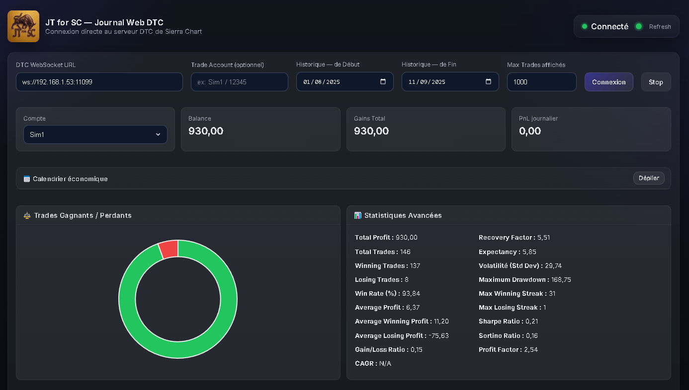
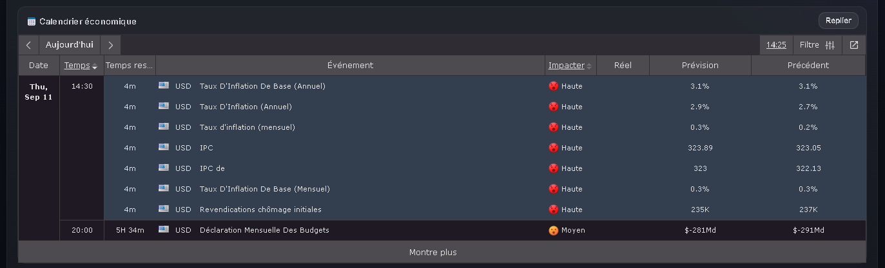
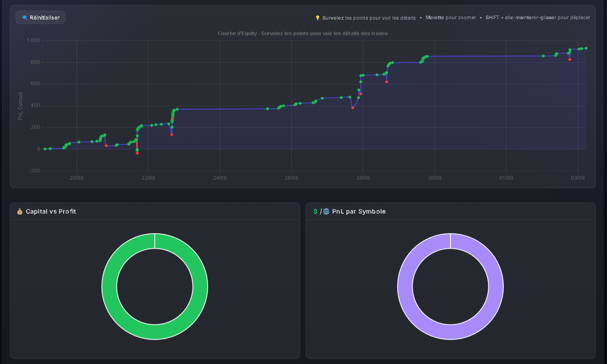
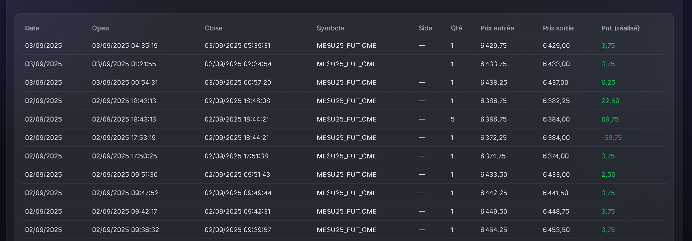
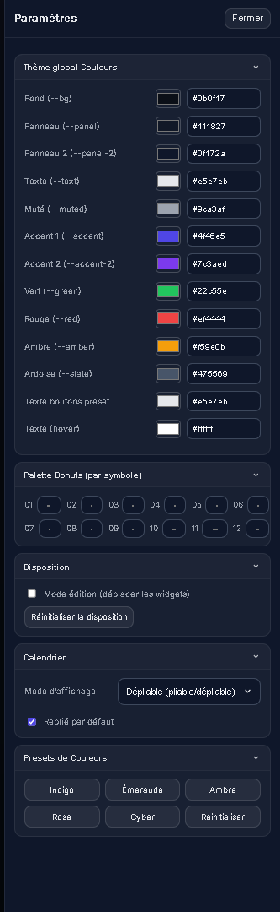
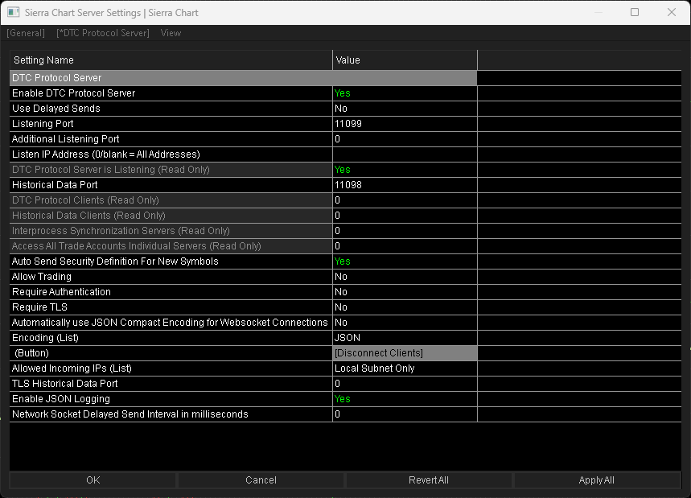

# JT for SC — Journal Web DTC pour Sierra Chart

> Dashboard web local connecté au **serveur DTC** (Sierra Chart) : KPI, stats avancées, **courbe d'equity**, **donuts** par performance, **journal des trades**, **thème & layout** personnalisables, **calendrier économique**.

- **Client pur (HTML/CSS/JS)** — aucun backend requis.
- Connexion **WebSocket DTC** (URL configurable dans l'UI).
- **Charts interactifs** (Chart.js + zoom/pan), persistance via `localStorage`.

---

## Contributions & forks bienvenus — Maintainer recherché

Je n'ai **plus le temps de maintenir activement** ce projet.
Si tu le trouves utile, **contribue** (PR/Issues) ou **forke** librement (licence MIT).
Je suis **ouvert à passer le relais** à un(e) maintainer motivé(e).

**Comment aider :**
- **Fork** le dépôt → clone ton fork en local.
- Crée une branche (`feat/…`), commite, pousse, puis **ouvre une Pull Request**.
- Si tu veux devenir **maintainer**, ouvre une issue « Maintainer candidacy » en décrivant ton plan.

Voir [CONTRIBUTING.md](CONTRIBUTING.md) pour les règles de contribution.

---

## Captures d'écran

1. **En-tête & connexion DTC + KPI**
   

2. **Calendrier de News**
   

3. **Courbe d'equity + donuts**
   

4. **Journal des trades (tableau)**
   

5. **Panneau Paramètres**
   

6. **Global Settings → Sierra Chart Server Settings**
   

---

## Fonctionnalités

- **Connexion DTC WebSocket** (ws/wss) + contrôles : URL, Trade Account (optionnel), période, limite de trades
- **KPI** : Balance, Gains Total, PnL journalier
- **Stats avancées** : Win rate, Profit Factor, Expectancy, Recovery Factor, Sharpe/Sortino, Max Drawdown, Streaks, etc.
- **Courbe d'equity** avec points d'entrée/sortie + zoom/pan + bouton Réinitialiser
- **Donuts** : Répartition gagnants/perdants & PnL par symbole
- **Journal des trades** (table responsive)
- **Paramètres** : thème (variables CSS), palette donuts, mode édition (drag des widgets), persistance layout + couleurs
- **Calendrier économique** intégrable/pliable

---

## Structure des fichiers

```
.
├── index.html                # Application principale (single-page)
├── serve.sh                  # Serveur HTTP minimal (Python 3)
├── CHANGELOG.md              # Historique des versions
├── CONTRIBUTING.md           # Guide de contribution
├── .editorconfig             # Conventions d'édition
├── .gitignore
├── assets/
│   ├── logo.svg
│   ├── icon.ico
│   ├── css/
│   │   ├── variables.css     # Custom properties (couleurs, espacements)
│   │   ├── main.css          # Styles principaux
│   │   ├── donut-fixes.css   # Correctifs donuts
│   │   └── calendar.css      # Styles calendrier
│   └── vendor/
│       ├── chart.umd.min.js
│       ├── hammer.min.js
│       ├── chartjs-plugin-zoom.min.js
│       └── chartjs-adapter-date-fns.bundle.min.js
└── docs/                     # Captures d'écran
```

---

## Démarrer en local

### Option A — Serveur HTTP (recommandé)

```bash
./serve.sh          # port 8888 par défaut
# ou
./serve.sh 3000     # port personnalisé
```

Puis ouvrir http://localhost:8888

### Option B — Ouvrir directement le fichier

Double-cliquer sur `index.html`. Selon le navigateur, certaines politiques de sécurité peuvent limiter des fonctions (WebSocket vers localhost fonctionne généralement, mais les CORS/EPR peuvent bloquer). Privilégier l'Option A.

---

## Configuration requise

- **Sierra Chart** avec le serveur DTC WebSocket activé :
  - Global Settings → Sierra Chart Server Settings → cocher **Enable DTC Server**
  - Port par défaut : **11099** (WebSocket)
  - L'URL par défaut dans l'app est `ws://127.0.0.1:11099`
- **Navigateur moderne** (Chrome, Firefox, Edge — ES2020+)
- **Aucune dépendance à installer** — les libs front (Chart.js, hammer.js, etc.) sont incluses dans `assets/vendor/`

---

## Licence (MIT)

Copyright (c) 2025 Fun — JT for SC

Permission is hereby granted, free of charge, to any person obtaining a copy
of this software and associated documentation files (the "Software"), to deal
in the Software without restriction, including without limitation the rights
to use, copy, modify, merge, publish, distribute, sublicense, and/or sell
copies of the Software, and to permit persons to whom the Software is
furnished to do so, subject to the following conditions:

The above copyright notice and this permission notice shall be included in
all copies or substantial portions of the Software.

THE SOFTWARE IS PROVIDED "AS IS", WITHOUT WARRANTY OF ANY KIND, EXPRESS OR
IMPLIED, INCLUDING BUT NOT LIMITED TO THE WARRANTIES OF MERCHANTABILITY,
FITNESS FOR A PARTICULAR PURPOSE AND NONINFRINGEMENT. IN NO EVENT SHALL THE
AUTHORS OR COPYRIGHT HOLDERS BE LIABLE FOR ANY CLAIM, DAMAGES OR OTHER
LIABILITY, WHETHER IN AN ACTION OF CONTRACT, TORT OR OTHERWISE, ARISING FROM,
OUT OF OR IN CONNECTION WITH THE SOFTWARE OR THE USE OR OTHER DEALINGS IN
THE SOFTWARE.